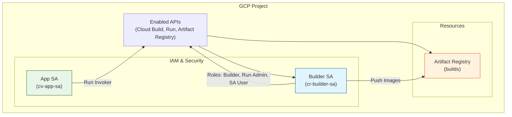

# Diagram Architektury GCP

```mermaid
graph TD
    subgraph "GCP Project"
        API["Enabled APIs<br/>(Cloud Build, Run, Artifact Registry)"]
        
        subgraph "IAM & Security"
            BuilderSA["Builder SA<br/>(cr-builder-sa)"]
            AppSA["App SA<br/>(cv-app-sa)"]
        end

        subgraph "Resources"
            AR["Artifact Registry<br/>(builds)"]
        end
    end

    %% Relacje
    API --> BuilderSA
    API --> AR
    
    %% Uprawnienia Buildera
    BuilderSA -- "Roles: Builder, Run Admin, SA User" --> API
    BuilderSA -- "Push Images" --> AR
    
    %% Uprawnienia Aplikacji
    AppSA -- "Run Invoker" --> API
    
    style BuilderSA fill:#e1f5fe,stroke:#01579b
    style AppSA fill:#e8f5e9,stroke:#1b5e20
    style AR fill:#fff3e0,stroke:#e65100
```